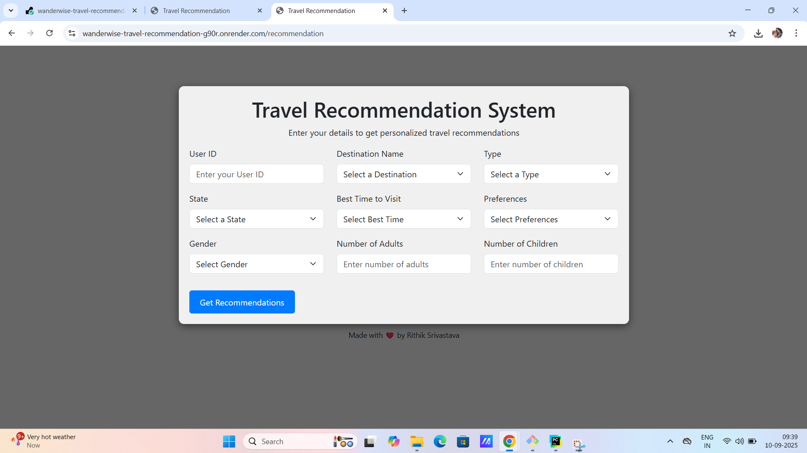

# 🌍 Wanderwise – AI-Powered Travel Recommendation System

[](https://wanderwise-travel-recommendation-g90r.onrender.com)
[](https://github.com/slavebotallen/wanderwise-travel-recommendation)

# 🌍 Wanderwise – Travel Recommendation System  

A machine learning-powered **travel recommendation web application** that suggests destinations based on **user preferences, family size, and season**.  
Built with **Flask, scikit-learn, and Bootstrap**, and deployed on **Render**.  

---

## 🎯 Project Overview  
- **Goal**: Simplify travel planning by giving **personalized recommendations**.  
- **Input**: Preference (Adventure, Heritage, Beach, Hill Station), Adults, Children, Season.  
- **Output**: Top destinations with details (Name, State, Type, Best Season).  
- **Approach**: Hybrid ML model (Content-based + Collaborative filtering).  
- **Deployment**: Flask + Docker + Render.  
- **Live App**: 👉 [Wanderwise on Render](https://wanderwise-travel-recommendation-g90r.onrender.com)  

---

## 🤖 Model Architecture  

### 🔹 Machine Learning Model  
- **Content-Based Filtering** – Matches user inputs with attributes (destination type, season).  
- **Collaborative Filtering** – Leverages user histories to suggest what similar users liked.  
- **Hybrid Scoring** – Combines both approaches for more accurate and diverse results.  

### 🔹 Features Used  
- Destination category (Adventure, Heritage, etc.)  
- Best season to visit  
- Adults and children count  
- User preference history  

### 🔹 Artifacts  
- `model.pkl` → trained ML model  
- `label_encoders.pkl` → categorical encoders  
- Datasets → `Expanded_Destinations.csv`, `Final_Updated_Expanded_UserHistory.csv`, etc.  

---

## 🚀 Features  
- 🎯 Personalized travel recommendations  
- 👨‍👩‍👧 Family-friendly suggestions (children filter)  
- 🌦 Seasonal recommendations (best time to visit)  
- 🖥️ Responsive UI (Bootstrap + custom CSS)  
- 🚀 Deployed publicly on Render  
- 📊 Submission-ready (PPTX, Report, Demo video included)  

---

## 📂 Project Structure  
```
wanderwise-travel-recommendation-master/
├── app.py
├── requirements.txt
├── Dockerfile
├── Procfile
├── README.md
│
├── templates/
│   ├── index.html
│   ├── recommendation.html
│
├── static/
│   ├── Travel Agency Logo Advert.mp4
│   └── screenshots/
│       ├── form.png
│       ├── results.png
│
├── code and dataset/
│   ├── Expanded_Destinations.csv
│   ├── Final_Updated_Expanded_Reviews.csv
│   ├── Final_Updated_Expanded_UserHistory.csv
│   ├── Final_Updated_Expanded_Users.csv
│   ├── Travel_Recommendation_System.ipynb
│   ├── final_df.csv
│   ├── model.pkl
│   └── label_encoders.pkl
└── .gitignore
```

---

## 🛠️ Installation & Setup  

### Local Development  
```bash
git clone https://github.com/slavebotallen/wanderwise-travel-recommendation.git
cd wanderwise-travel-recommendation-master

# Create virtual environment
python -m venv venv
source venv/bin/activate   # Linux/Mac
venv\Scripts\activate      # Windows

# Install dependencies
pip install -r requirements.txt

# Run app
python app.py
```

Visit → `http://127.0.0.1:5000/`  

---

### 🚀 Deploy on Render  
1. Fork this repo.  
2. Link GitHub repo on [Render Dashboard](https://dashboard.render.com).  
3. Configure:  
   - Start command: `gunicorn app:app`  
   - Python: 3.9+  
   - Auto-install dependencies from `requirements.txt`  
4. Deploy → share live link.  

```

---

## 📷 Screenshots
| Input Form | Recommendations |
|------------|-----------------|
|  |  |

---

---

## 📊 Results & Observations  
- ✅ Recommendations are **accurate & personalized**  
- ✅ Handles family trips intelligently  
- ✅ Responsive interface  
- ✅ Works smoothly on Render  

---

## 📝 Future Work  
- 💰 Budget & activity-based filters  
- 🌦 Real-time weather & events integration  
- 🤖 Deep learning recommenders (NCF, autoencoders)  
- 🗄️ Database support (Postgres/MongoDB)  
- 📱 Mobile-friendly Progressive Web App  

---


---

## About Me
### 👤 Author

**Rithik Srivastava** 

📧 Email: 24082046@scale.iitrpr.ac.in

👨‍🎓 Student Code: IITRPRAI_24082046

🏛️ College: Indian Institute of Technology, Ropar 

---

## 🌐 Live Project
👉 **[Try Wanderwise on Render](https://wanderwise-travel-recommendation-g90r.onrender.com)**
